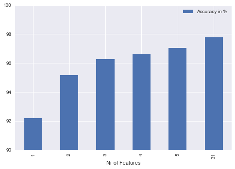

<script type="text/javascript" src="http://cdn.mathjax.org/mathjax/latest/MathJax.js?config=TeX-AMS-MML_HTMLorMML"></script>

# Finding Best Features (Ex 03)
##### Machine Learning Course @JCE - by Ilya Krasnov (341008159)

### Project Scope and Description
Given the logistic regression algorithm developed in [Ex02][1], the goal was to find 5 features that deliver best predictions as compared to the whole dataset containing all features.

### Tools and Implementation
The algorithm was implemented in Python, using Pandas for data frame manipulation as well as seaborn and matplotlib for visualisation.
For convenience, the project was implemented using a jupyter notebook. The notebook as well as this report are under version control and can be found on [github][2]

### Implemented Algorithm
The basic algorithm from [Ex02][1] was used to calculate the accuracy of a given dataset.

In order to calculate the best feature at any given time, I started with the dataset containing only the *1-Feature*. A simple loop was introduced to add the first best, second best, etc features. In every iteration all the features which are still not in, were added one by one. The accuracy with a particular feature added was calculated and saved in a dictionary of the form:

```python
{
  7: 96.55,
  21: 71.56
}

```

A resulting dictionary indicates that by adding *feature #7* the accuracy would be *96.55%* while *feature #21* would result in the accuracy of *71.56%*. The best feature to add to the new dataset was simply computed, getting the maxim value key from the dictionary. In case of ties, where two or more features were about to result in the same accuracy, the first one was selected.

### Results

The resulting features added were consecutively: `8, 24, 28, 11, 12`, with the resulting accuracies being as follows (including the accuracy for the whole dataset including all 31 features):

```python
{
'Accuracies': [92.19,:  95.17, 96.28,  96.65,  97.02,  97.77],
'Feature added': [8, 24, 28, 11, 12],
'Nr of Features': [1, 2, 3, 4, 5, 31]
}
```


#### Plotting the results


### Conclusion
It is interesting to denote, that the given dataset offering a *97.77%* accuracy when considering all 31 features, also performed well (with accuracy over *90%*) given only one feature, with growing accuracy whith every added features. The dataset with only 5 best features performed almost as well as the complete on, disregarding the decimal percent point, for both being *97%*.

Surely, the results will differ from dataset to dataset. For large datasets, where computations on all given features can be very costly, it can be a good strategy to check for accuracy, the first best *n* features would produce. If the accuracy is satisfies the expected results (which should depend on the problem we are dealing with), we can disregard all other featues, thus simplifying our model and minimizing calculation costs.

[1]: https://github.com/ilyakrasnov/ml-course/blob/master/Ex02.ipynb
[2]: https://github.com/ilyakrasnov/ml-course-ex03/blob/master/Ex03.ipynb
